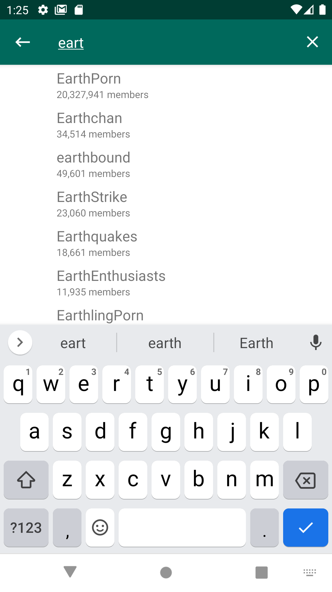
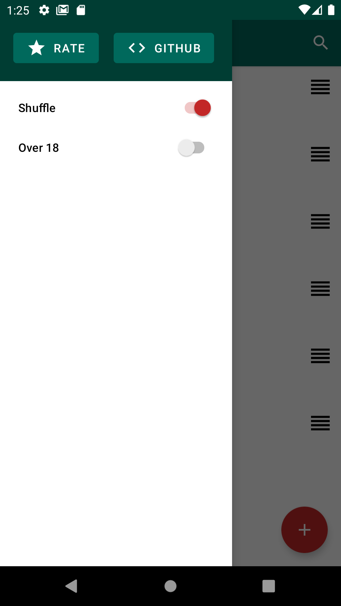

# Vitrina

> A companion app for [Muzei](https://github.com/romannurik/muzei) that fetches images from Reddit.

  

Vitrina lets you define your favourite subreddits where you want to get background images from, and Muzei does the rest.

