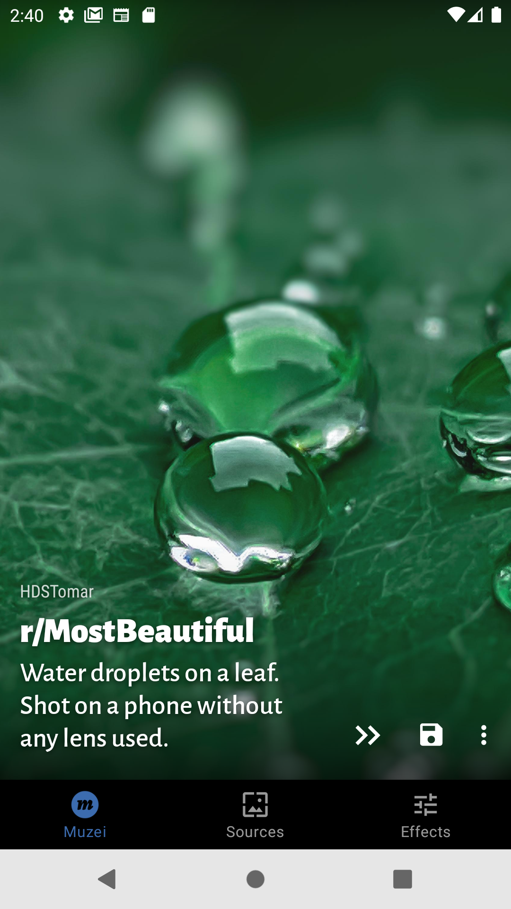
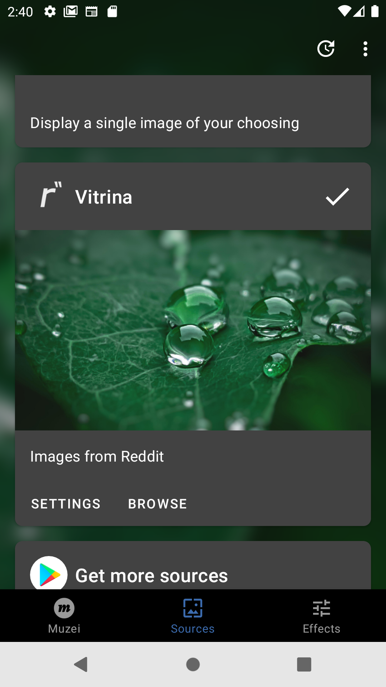

> Note:
>
> This is the code for the legacy version. You can still submit issues here, I will read them.
>
> If you are here because you want to reset your app's version to free one, [have a look at this issue](https://github.com/andrasferenczi/vitrina-legacy/issues/21).
>
> Also, check out the [website of the new app version](https://vitrina.gallery).

---

# Vitrina

> A companion app for [Muzei](https://github.com/romannurik/muzei) that fetches images from Reddit.

    

Vitrina lets you specify your favourite image subreddits where you want to get your background from and Muzei does the rest.

---

## Manual / FAQ

### Subreddits listing

#### `Add new subreddit`

Either by clicking the `plus icon` or the `search icon`.

#### `Reorder subreddits`

Use the `hamburger icon` in each list item.

#### `Delete subreddits`

Swipe left on the given list item. No confirmation message is shown.

#### `Minimum upvote count`

Specify a minimum number of upvotes (simply click to edit). Posts that have a lower score than that will not be shown.

### Settings

#### `Shuffle`

If enabled, the subreddit listing will be mixed together. Artworks will be chosen from all subreddits.

If disabled, artworks will be picked in the order they are specified on the listing page.

#### `Over 18`

This is obvious.

It affects the autocomplete feature in the search and what artworks will be served as your background.

#### Minimum Image Resolution

The minimum size of the image can be specified here. If an image does not meet the requirements for width and height, it will not be shown.
